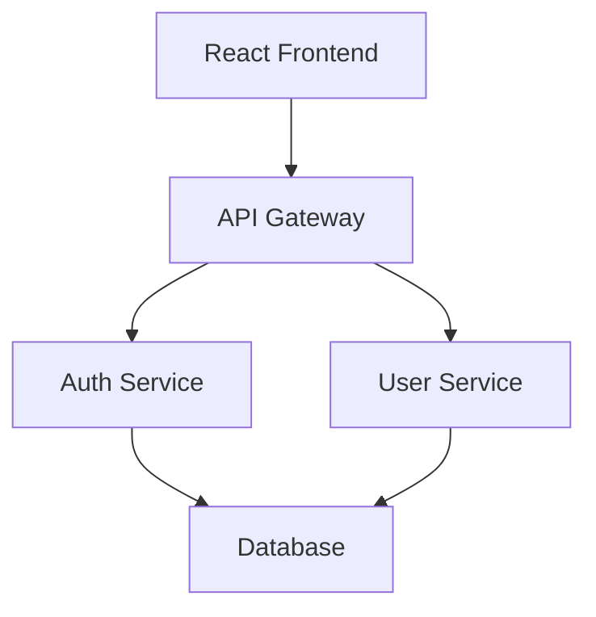

Verdent for VS Code helps you understand unfamiliar codebases through natural language questions and automated exploration. The built-in Explorer subagent quickly finds files, searches code patterns, and answers architectural questions without consuming your main context window.

### What You'll Learn

- Explore unfamiliar codebases using the Explorer subagent
- Ask questions about code structure and implementation
- Get detailed explanations of functions, classes, and modules
- Generate documentation from existing code
- Understand project architecture and data flow
- Onboard new team members efficiently

### Prerequisites

Before using Verdent to understand code:

- Visual Studio Code with Verdent extension installed
- A codebase or project workspace open in VS Code
- Active Verdent subscription with available credits

---

## Exploring Unfamiliar Codebases

When you ask questions about codebase structure or request file searches, Verdent automatically delegates to the **Explorer subagent** (`@Explorer`), a token-efficient specialist optimized for fast codebase exploration.

The Explorer subagent quickly:
- Finds files matching patterns or names
- Searches code for specific keywords or functions
- Answers architectural questions about the codebase
- Identifies where functionality is implemented

**Example Exploration Questions:**

```
What is the structure of this project?
```

```
Where is user authentication handled?
```

```
Find all API endpoint definitions
```

```
Show me where database queries are defined
```

The Explorer works efficiently in the background, providing fast answers without consuming your main context window. Verdent presents findings with relevant file paths and code snippets.

**Parallel Exploration for Complex Tasks:**

For complex exploration tasks, multiple Explorer agents can run in parallel to save time, each investigating different aspects of the codebase simultaneously. Verdent then synthesizes the findings into a coherent summary.

**Example:**

```
Use the Explorer agent to find all places where we manually validate email addresses
```

This ensures Verdent discovers every location systematically without missing instances across the codebase.

---

## Asking Questions About Your Code

Verdent answers virtually any question about your codebase using natural language. The AI understands context and provides detailed explanations, analysis, and insights.

<Tabs>
  <Tab title="Code Understanding">
    Ask about how specific functionality works:

    ```
    Explain how authentication works in this project
    ```

    ```
    What does the calculateTotal function do?
    ```

    ```
    How are API requests handled?
    ```

    Verdent analyzes the relevant code, traces execution flows, and explains the implementation with references to specific files and line numbers.
  </Tab>

  <Tab title="Architecture & Structure">
    Understand the big picture of your application:

    ```
    What is the overall architecture of this application?
    ```

    ```
    How do the components communicate with each other?
    ```

    ```
    What design patterns are used in this codebase?
    ```

    Verdent examines your project structure, identifies patterns, and explains architectural decisions.
  </Tab>

  <Tab title="Implementation">
    Get insights into technical decisions:

    ```
    Why do you think Redux was chosen instead of Context API for state management?
    ```

    ```
    What would happen if I changed the API timeout from 30s to 60s?
    ```

    ```
    Is this validateUserInput function redundant?
    ```

    Verdent analyzes code context and provides reasoned explanations based on your project's patterns and industry best practices.
  </Tab>

  <Tab title="Discovery">
    Find specific functionality or dependencies:

    ```
    Where is user data validated?
    ```

    ```
    Show me all database queries in the project
    ```

    ```
    What dependencies does this project have?
    ```

    The Explorer subagent performs efficient searches using tools like grep (content search) and glob (file pattern matching), returning relevant results without consuming main context.
  </Tab>

  <Tab title="Learning">
    Understand algorithms and patterns:

    ```
    How does the quicksort algorithm work in the sortItems function?
    ```

    ```
    What are the best practices for error handling in React components?
    ```

    ```
    Explain the Observer pattern implementation in the EventEmitter class
    ```

    Verdent provides clear explanations with references to specific implementations in your codebase.
  </Tab>
</Tabs>

---

## Explaining Functions and Classes

Verdent provides detailed explanations of specific functions or classes by analyzing their implementation, parameters, return values, and usage throughout the codebase.

**Examples:**

```
Explain the UserAuth class
```

```
What does the processPayment function do?
```

```
Break down the ApiService class methods
```

**What Verdent Explains:**

- **Purpose**: What the function or class accomplishes
- **Parameters**: Input types, expected values, and constraints
- **Return Types**: Output types and possible return values
- **Internal Logic**: How the implementation works step-by-step
- **Dependencies**: External modules, functions, or services used
- **Usage Examples**: How the function/class is used elsewhere in your code

Verdent traces the code's execution flow, identifies edge cases, and explains the rationale behind implementation choices.

---

## Generating Documentation

Verdent generates documentation in multiple formats including inline code comments (JSDoc, Python docstrings, etc.), README files, API documentation, and architecture guides.

#### Using Plan Mode for Documentation

In Plan Mode, Verdent can:
- Analyze your existing documentation to match its style and density
- Ask clarifying questions about formatting preferences (comment style, detail level, examples inclusion)
- Analyze the codebase to understand current documentation patterns
- Present a documentation plan showing what will be documented and in what style

**Example:**

```
Generate JSDoc comments for all functions in the utils folder
```

Verdent examines existing JSDoc comments in your project, asks questions about preferences (parameter descriptions, example usage inclusion), then generates documentation matching your established conventions.

**Supported Documentation Formats:**

- **Inline Comments**: JSDoc, Python docstrings, Javadoc, XML documentation comments
- **README Files**: Project overviews, setup instructions, usage guides
- **API Documentation**: Endpoint descriptions, request/response formats, authentication details
- **Architecture Guides**: System design explanations, component relationships, data flow diagrams

<Tip>
  Use Plan Mode when generating extensive documentation. Verdent will review your existing documentation style and ask clarifying questions to ensure generated docs match your project's conventions.
</Tip>

<Tip>
Use Plan Mode when generating documentation for multiple files, review the documentation structure before committing.
</Tip>

---

## Summarizing Files and Modules

Verdent analyzes and summarizes files or modules by reading the code, understanding its structure, and explaining its purpose in plain language.

**Examples:**

```
Summarize what the authMiddleware.js file does
```

```
Explain the purpose of the UserService module
```

```
What's the main responsibility of the PaymentController?
```

**What Verdent Provides:**

- **Main Purpose**: What the file/module accomplishes in the system
- **Key Functions**: Primary functions or methods and their roles
- **Dependencies**: External modules and services used
- **Exports**: Public API and what other parts of the system can access
- **Patterns**: Design patterns or architectural approaches used
- **Integration Points**: How it connects with other parts of the project

Verdent reads the file, identifies key functions, traces dependencies, and explains how the code fits into the larger project architecture.

---

## Understanding Architecture

Verdent explains architecture through detailed text descriptions, component relationships, and data flow explanations. While it doesn't generate graphical diagrams directly, it can create ASCII art diagrams or Mermaid diagram code that you can render.

**Example:**

```
Explain the architecture of this application and show component relationships
```

Verdent might produce an ASCII representation:

```
Frontend (React)
    ↓
API Layer (Express)
    ↓
Service Layer (Business Logic)
    ↓
Database Layer (PostgreSQL)
```

Or generate Mermaid code for rendering:



**Architecture Explanations Include:**

- **Component Interactions**: How different parts of the system communicate
- **Data Flow**: How information moves through the application
- **Architectural Patterns**: MVC, microservices, layered architecture, etc.
- **Technology Stack**: Frontend, backend, database, external services
- **Integration Points**: APIs, message queues, webhooks, third-party services
- **Scalability Patterns**: Load balancing, caching, database sharding

Verdent analyzes your project structure, traces imports and dependencies, identifies patterns, and explains the architectural decisions behind your system design.

---

## Onboarding New Team Members

Verdent helps onboard new team members by answering questions about the codebase, explaining architectural decisions, identifying key files and patterns, and generating documentation tailored to help newcomers understand the project structure and conventions.

**In Plan Mode**, Verdent can ask clarifying questions to understand what aspects of the codebase are most relevant to the new team member's role before creating a personalized onboarding guide.

**Example Onboarding Questions:**

```
What's the best starting point for understanding this codebase?
```

```
How does data flow from the API to the frontend?
```

```
Where should I look to understand the authentication system?
```

```
What are the naming conventions and code style guidelines used here?
```

**Verdent Can Generate:**

- **Onboarding Guides**: Step-by-step walkthroughs of the codebase architecture
- **Component Maps**: Visual or text-based guides showing how components relate
- **Common Patterns**: Documentation of frequently used patterns and conventions
- **Setup Instructions**: How to configure development environment and run the project
- **First Tasks**: Suggestions for simple first contributions to gain familiarity

New team members can explore the codebase conversationally, getting immediate answers without needing to interrupt senior developers or spend hours reading through code.

<Note>
  Verdent's Explorer subagent makes codebase discovery efficient for newcomers. They can ask broad questions like "Show me all React components" or specific queries like "Where is error logging implemented?" and get immediate, accurate answers.
</Note>

---

## Best Practices

<Accordion title="Start with broad questions, then drill down">
  Begin with high-level questions like "What is the architecture?" before diving into specific implementations. This builds context progressively.
</Accordion>

<Accordion title="Use the Explorer subagent explicitly for comprehensive searches">
  For thorough searches across the codebase, explicitly mention the Explorer agent to ensure no instances are missed: "Use Explorer to find all authentication checks."
</Accordion>

<Accordion title="Ask 'why' questions, not just 'what'">
  Understanding the rationale behind decisions is often more valuable than understanding the implementation. Ask "Why was this pattern chosen?" alongside "What does this code do?"
</Accordion>

<Accordion title="Leverage Plan Mode for documentation generation">
  When generating docs, use Plan Mode to review Verdent's approach, ensure it matches your style, and refine the plan before execution.
</Accordion>

<Accordion title="Use @-mentions for focused explanations">
  Reference specific files when you want detailed explanations: "@components/UserProfile.tsx explain this component" ensures Verdent focuses on the right code.
</Accordion>

<Accordion title="Build context before requesting changes">
  Before making modifications, ask Verdent to explain the current implementation. This helps Verdent make better suggestions that align with existing patterns.
</Accordion>

<Accordion title="Ask follow-up questions freely">
  Verdent maintains conversation context, so you can ask clarifying questions, request deeper explanations, or explore related topics without repeating context.
</Accordion>

---

## See Also

<CardGroup cols={2}>
  <Card title="Writing New Code" icon="code" href="/verdent-for-vscode/task-based-guides/writing-code">
    Learn how to write new features and components with Verdent
  </Card>

  <Card title="Refactoring Code" icon="wrench" href="/verdent-for-vscode/task-based-guides/refactoring">
    Improve and refactor existing code safely with AI assistance
  </Card>
</CardGroup>
