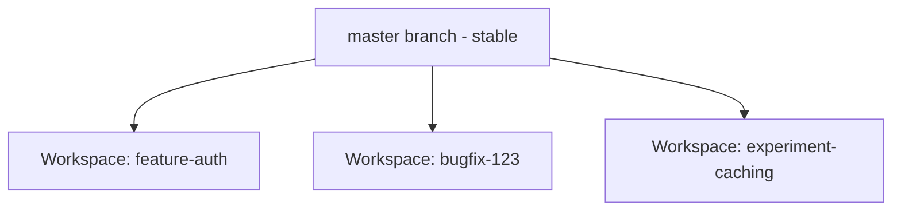

Parallel development enables you to work on multiple features, bug fixes, and experiments simultaneously. Each runs in its own isolated workspace, where tasks and their agents work independently.

---

## What You'll Learn

- Set up parallel development workflows
- Work on features, bugs, and experiments simultaneously
- Common patterns for parallel execution

---

## Overview

Parallel development combines:
- **Workspace Isolation** - Each workspace has its own branch and file state
- **Parallel Tasks** - Multiple tasks with their own agents working simultaneously
- **Selective Rebasing** - Choose which results to integrate

| Benefit | Description |
|---------|-------------|
| **Faster** | Multiple agents complete work in parallel |
| **No Conflicts** | Isolated workspaces prevent interference |
| **Safe Experimentation** | Try different approaches without risk |

---

## Setting Up Parallel Work

<Steps>
  <Step title="Create First Workspace">
    Click **New Workspace** in the Top Bar, name it `feature-auth`
  </Step>
  <Step title="Start First Task">
    In the input box, describe the feature and send to start a task with its agent
  </Step>
  <Step title="Create Second Workspace">
    Without waiting, click **New Workspace** again, name it `bugfix-123`
  </Step>
  <Step title="Start Second Task">
    Describe the bug fix to start another task with its agent
  </Step>
  <Step title="Create More as Needed">
    Repeat for additional parallel tasks
  </Step>
</Steps>

### Workspace Structure

### Monitoring Progress

Switch between workspaces to check progress:

| Action | Shortcut |
|--------|----------|
| **Next workspace** | `Ctrl+Tab` |
| **Previous workspace** | `Ctrl+Shift+Tab` |

All tasks and their agents continue working regardless of which workspace you're viewing.

---

## Workflow Patterns

<Tabs>
  <Tab title="Feature + Bug Fix">
    Work on a feature while addressing an urgent bug:

    | Workspace | Task |
    |-----------|------|
    | `feature-dashboard` | Continue feature work |
    | `hotfix-security` | Fix critical bug |

    Bug fix completes first → rebase immediately. Feature continues unaffected.
  </Tab>
  <Tab title="Multiple Approaches">
    Try different solutions to the same problem:

    | Workspace | Approach |
    |-----------|----------|
    | `approach-redux` | Implement using Redux |
    | `approach-context` | Implement using Context API |
    | `approach-zustand` | Implement using Zustand |

    Compare results, rebase preferred approach, delete others.
  </Tab>
  <Tab title="Independent Features">
    Build multiple unrelated features simultaneously:

    | Workspace | Feature |
    |-----------|---------|
    | `feature-auth` | User authentication |
    | `feature-dashboard` | Dashboard UI |
    | `feature-notifications` | Notification system |

    Each feature develops independently, rebase when complete.
  </Tab>
</Tabs>

---

## Completing Parallel Work

<Steps>
  <Step title="Review Each Workspace">
    Click **Task Changes** to review changes for each workspace
  </Step>
  <Step title="Address Issues">
    Fix any problems found in reviews
  </Step>
  <Step title="Commit Changes">
    Use Source Control (`Ctrl+Shift+G`) to commit with descriptive messages
  </Step>
  <Step title="Rebase to main branch">
    Click **Workspace Actions → Rebase to main branch** for each completed workspace
  </Step>
  <Step title="Clean Up">
    To delete a workspace, click the **trash icon** near the workspace name in the Workspace Bar, or right-click the workspace in the top bar and select **Delete**.
  </Step>
</Steps>

---

## Best Practices

### Good Candidates for Parallel Work

- Independent features
- Bug fixes unrelated to current work
- Experiments and proof-of-concepts
- Different approaches to same problem

### Poor Candidates

- Tasks with dependencies (A must complete before B)
- Very small, quick tasks
- Tasks requiring tight coordination

---

## FAQs

<Accordion title="How many parallel tasks should I run?">
Start with 2-3 and increase based on performance. Complex tasks may need more resources per agent.
</Accordion>

<Accordion title="What if parallel tasks need to share code?">
If tasks need shared code, they may not be good candidates for parallelization. Complete shared work first, then parallelize independent follow-up tasks.
</Accordion>

<Accordion title="Do tasks stop when I switch workspaces?">
No. Tasks and their agents continue working in the background when you switch to another workspace.
</Accordion>

<Accordion title="What is Task Changes?">
Task Changes shows the total set of code changes made across the entire task so far. It reflects everything that has been modified since the task started.
</Accordion>

<Accordion title="What is Step Changes?">
Step Changes shows only the code changes introduced by the current prompt. It reflects what was added or modified in this specific execution step.
</Accordion>

---

## See Also

<CardGroup cols={2}>
  <Card title="Agents" icon="users" href="/verdent/core-features/agents">
    Core agents features
  </Card>
  <Card title="Workspace Isolation" icon="shield-halved" href="/verdent/core-features/workspace-isolation">
    How workspaces stay isolated
  </Card>
</CardGroup>
