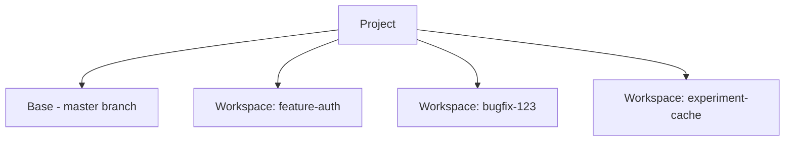

Workspaces provide isolated environments for parallel development. Each workspace operates on its own branch, with changes rebased to master when complete.

<Note>
Each workspace can contain multiple tasks. Tasks share the workspace's file state but have their own conversation context and agent.
</Note>

---

## What You'll Learn

- Create and name workspaces
- Switch between workspaces
- Rebase changes to master
- Clean up completed workspaces

---

## Creating Workspaces

### Quick Create

Press `Cmd+Shift+N` (macOS) or `Ctrl+Shift+N` (Windows)

### Step-by-Step

<Steps>
  <Step title="Click New Workspace">
    Click **New Workspace** in the Top Bar
  </Step>
  <Step title="Name Your Workspace">
    Enter a descriptive name (e.g., `feature-auth`, `bugfix-123`)
  </Step>
  <Step title="Start Working">
    You're now in the isolated workspace with its own branch
  </Step>
</Steps>

### Naming Conventions

| Pattern | Example | Use For |
|---------|---------|---------|
| `feature-{name}` | `feature-auth` | New features |
| `bugfix-{id}` | `bugfix-123` | Bug fixes |
| `hotfix-{name}` | `hotfix-security` | Urgent fixes |
| `experiment-{name}` | `experiment-caching` | Experiments |

---

## Managing Workspaces

### Viewing All Workspaces

Click **All Workspaces** in the Top Bar to see all active workspaces.

### Workspace Hierarchy

### Switching Workspaces

| Action | Shortcut |
|--------|----------|
| **Next Workspace** | `Ctrl+Tab` |
| **Previous Workspace** | `Ctrl+Shift+Tab` |
| **Select Specific** | Click **All Workspaces** |

---

## Rebasing to Master

When your work is complete, rebase changes to master:

<Steps>
  <Step title="Commit Changes">
    Use Source Control (`Ctrl+Shift+G`) to stage and commit with a descriptive message
  </Step>
  <Step title="Test">
    Run tests to ensure everything works
  </Step>
  <Step title="Rebase">
    Click **Workspace Actions → Rebase to master**
  </Step>
  <Step title="Clean Up">
    Click **Delete Workspace** in the Workspace Bar
  </Step>
</Steps>

---

## Cleaning Up Workspaces

### When to Delete

| Scenario | Action |
|----------|--------|
| Work rebased | Delete workspace |
| Experiment failed | Delete workspace |
| Approach superseded | Delete workspace |
| Still active | Keep workspace |

### How to Delete

Click **Delete Workspace** in the Workspace Bar.

<Warning>
Uncommitted changes are lost when deleting a workspace. Always commit work before deleting.
</Warning>

---

## FAQs

<Accordion title="Can I rename a workspace?">
Not directly. Create a new workspace with the desired name, rebase changes, then delete the old workspace.
</Accordion>

<Accordion title="How much disk space does each workspace use?">
Each workspace duplicates working files. If your project is 500MB, each workspace adds roughly 500MB. The `.git` directory is shared.
</Accordion>

<Accordion title="What happens if I delete the project folder?">
All workspaces are inside the project folder. Deleting the project folder deletes all workspaces.
</Accordion>

---

## See Also

<CardGroup cols={2}>
  <Card title="Workspace Isolation" icon="shield-halved" href="/verdent/core-features/workspace-isolation">
    How isolation works
  </Card>
  <Card title="Parallel Development" icon="code-branch" href="/verdent/common-workflows/parallel-development">
    Parallel workflow patterns
  </Card>
</CardGroup>
