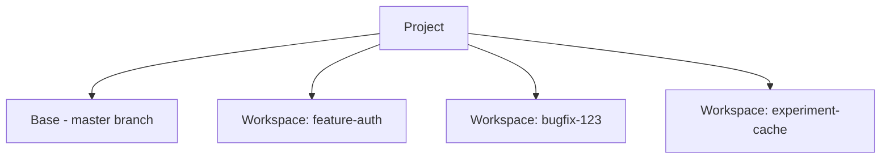

Workspaces provide isolated environments for parallel development. Each workspace operates on its own branch, with changes rebased to the main branch when complete.

<Note>
Each workspace can contain multiple tasks. Tasks share the workspace's file state but have their own conversation context and agent.
</Note>

---

## When Workspaces are Ideal

Workspaces solve common parallel development challenges:

<Tabs>
  <Tab title="Frequent Interruptions">
    **Problem:** While working on a feature, you're interrupted by urgent bugs or requests. Your flow breaks, and every return requires a mental "cold start."

    **Solution:** Stay in flow even when new tasks interrupt. Handle new tasks instantly, keep your original work intact, and pick up exactly where you left off.

    <Steps>
      <Step title="Focus on your current task">
        Work inside one Workspace and push forward
      </Step>
      <Step title="A new task appears">
        Urgent bug or request that needs immediate attention
      </Step>
      <Step title="Create a new Workspace">
        Work on the new task without interrupting the original
      </Step>
      <Step title="Run multiple tasks in parallel">
        Each task progresses in its own Workspace
      </Step>
      <Step title="Switch freely at any time">
        Jump between Workspaces without mental reset
      </Step>
      <Step title="Integrate results when done">
        Merge back to the main codebase or submit directly
      </Step>
      <Step title="Resume original work">
        Pick up exactly where you left off
      </Step>
    </Steps>
  </Tab>
  <Tab title="Uncertain Solutions">
    **Problem:** You face a complex problem with multiple possible approaches. Each seems reasonable, but implementation costs make it hard to know which is truly better.

    **Solution:** Don't argue, run it and see. Instead of debating which solution is right, you run them and let results decide.

    <Steps>
      <Step title="Create Workspaces for each solution">
        All solutions are isolated from each other
      </Step>
      <Step title="Run them in parallel">
        Implement and validate simultaneously without interference
      </Step>
      <Step title="Switch freely and compare results">
        Compare complexity, code changes, and real execution behavior
      </Step>
      <Step title="Keep the best, discard the rest">
        Merge the optimal solution, drop the others
      </Step>
    </Steps>
  </Tab>
  <Tab title="Complex Requirements">
    **Problem:** You have a complex requirement with many interconnected parts (API, business logic, frontend, tests). Sequential workflows cause bottlenecks: one part waits on another.

    **Solution:** Turn step-by-step work into parallel execution. Faster delivery comes from parallelism, not pressure.

    <Steps>
      <Step title="Break down the requirement">
        Split into independently executable parts with clear boundaries
      </Step>
      <Step title="One Workspace per part">
        Code changes don't interfere between subtasks
      </Step>
      <Step title="Run in parallel, no waiting">
        Modules progress simultaneously
      </Step>
      <Step title="Each part stabilizes independently">
        Test and validate on its own timeline
      </Step>
      <Step title="Resolve merge conflicts">
        Verdent helps with diagnosis and resolution
      </Step>
      <Step title="Merge incrementally, deliver holistically">
        Assemble the final result module by module
      </Step>
    </Steps>
  </Tab>
</Tabs>

---

## What You'll Learn

- Create and name workspaces
- Switch between workspaces
- Rebase changes to the main branch
- Clean up completed workspaces

---

## Understanding Workspaces

Each workspace is an isolated environment for development:

| Workspace Type | Description |
|----------------|-------------|
| **Base** | The main project directory (default) |
| **Worktree** | Isolated git worktree with independent branch |

**Worktree workspaces** use git worktrees to create completely isolated working copies in `.worktrees/{name}`. Each worktree:

- Has its own branch checkout
- Can make independent file changes
- Allows staging and committing separately
- Prevents conflicts between parallel tasks

---

## Creating Workspaces

### Quick Create

Press `Cmd+Shift+N` (macOS) or `Ctrl+Shift+N` (Windows)

### Step-by-Step

<Steps>
  <Step title="Click New Workspace">
    Click **New Workspace** in the Top Bar
  </Step>
  <Step title="Name Your Workspace">
    Enter a descriptive name (e.g., `feature-auth`, `bugfix-123`)
  </Step>
  <Step title="Start Working">
    You're now in the isolated workspace with its own branch
  </Step>
</Steps>

### Naming Conventions

| Pattern | Example | Use For |
|---------|---------|---------|
| `feature-{name}` | `feature-auth` | New features |
| `bugfix-{id}` | `bugfix-123` | Bug fixes |
| `hotfix-{name}` | `hotfix-security` | Urgent fixes |
| `experiment-{name}` | `experiment-caching` | Experiments |

---

## Managing Workspaces

### Viewing All Workspaces

Click **All Workspaces** in the Top Bar to see all active workspaces.

### Workspace Hierarchy

### Switching Workspaces

| Action | Shortcut |
|--------|----------|
| **Next Workspace** | `Ctrl+Tab` |
| **Previous Workspace** | `Ctrl+Shift+Tab` |
| **Select Specific** | Click **All Workspaces** |

---

## Workspace Actions

Use **Workspace Actions** in the top bar for version control operations:

| Action | Description |
|--------|-------------|
| **Sync from Main** | Pull latest changes from main branch into workspace |
| **Rebase to Main** | Apply workspace changes to main branch |
| **Create PR** | Create a pull request from the current workspace branch |

### Sync from Main Workflow

Keep your workspace up to date with the main branch:

<Steps>
  <Step title="Sync">
    Click **Workspace Actions → Sync from Main**
  </Step>
  <Step title="Resolve Conflicts">
    If conflicts appear, resolve them in the affected files
  </Step>
  <Step title="Continue Working">
    Your workspace now has the latest changes from main
  </Step>
</Steps>

### Rebase Workflow

When your work is complete, rebase changes to the main branch:

<Steps>
  <Step title="Commit Changes">
    Use Source Control (`Ctrl+Shift+G`) to stage and commit with a descriptive message
  </Step>
  <Step title="Test">
    Run tests to ensure everything works
  </Step>
  <Step title="Rebase">
    Click **Workspace Actions → Rebase to Main**
  </Step>
  <Step title="Clean Up">
    To delete a workspace, click the **trash icon** near the workspace name in the Workspace Bar, or right-click the workspace in the top bar and select **Delete**.
  </Step>
</Steps>

### Pull Request Workflow

Create a pull request from your workspace:

<Steps>
  <Step title="Commit Changes">
    Use Source Control (`Ctrl+Shift+G`) to stage and commit with a descriptive message
  </Step>
  <Step title="Create PR">
    Click **Workspace Actions → Create PR**
  </Step>
  <Step title="Review">
    The PR is created from your workspace branch to the main branch
  </Step>
</Steps>

---

## Cleaning Up Workspaces

### When to Delete

| Scenario | Action |
|----------|--------|
| Work rebased | Delete workspace |
| Experiment failed | Delete workspace |
| Approach superseded | Delete workspace |
| Still active | Keep workspace |

### How to Delete

You can delete a workspace in two ways:

- Click the **trash icon** near the workspace name in the Workspace Bar
- Hover over the workspace in the top bar and right-click to open the menu, then select **Delete**

An **Archive** option is also available in the right-click menu if you want to keep the workspace for later reference.

<Warning>
Uncommitted changes are lost when deleting a workspace. Always commit work before deleting.
</Warning>

---

## Session Controls

Each workspace can contain multiple sessions. Control sessions using these actions:

| Action | Description |
|--------|-------------|
| **Stop** | Terminate the session immediately |
| **Delete** | Remove session and clean up resources |

---

## FAQs

<Accordion title="Can I rename a workspace?">
Not directly. Create a new workspace with the desired name, rebase changes, then delete the old workspace.
</Accordion>

<Accordion title="How much disk space does each workspace use?">
Each workspace duplicates working files. If your project is 500MB, each workspace adds roughly 500MB. The `.git` directory is shared.
</Accordion>

<Accordion title="What happens if I delete the project folder?">
All workspaces are inside the project folder. Deleting the project folder deletes all workspaces.
</Accordion>

---

## See Also

<CardGroup cols={2}>
  <Card title="Workspace Isolation" icon="shield-halved" href="/verdent/core-features/workspace-isolation">
    How isolation works
  </Card>
  <Card title="Parallel Development" icon="code-branch" href="/verdent/common-workflows/parallel-development">
    Parallel workflow patterns
  </Card>
</CardGroup>
