Parallel Execution is Verdent's ability to run multiple AI agents simultaneously, each with its own isolated context, transforming how you handle complex development work.

---

## What You'll Learn

- How parallel execution accelerates complex workflows
- Launching and managing multiple agents
- How agents coordinate without conflicts
- Workspace controls for running agents
- Best use cases for parallel execution

---

## What is Parallel Execution?

Parallel Execution allows you to run multiple AI agents simultaneously, each working independently with its own isolated context. Instead of waiting for one agent to finish before starting another, you can launch multiple agents at once, each working without interference. Agents can share a workspace or work in separate workspaces for isolated feature development.

### How It Works

| Component | Description |
|-----------|-------------|
| **Isolated Context** | Each agent maintains its own conversation context |
| **Workspace Flexibility** | Agents can share a workspace or work in separate workspaces |
| **No Interference** | Agents work independently without conflicts |
| **Selective Rebasing** | Workspace changes can be compared and selectively rebased |

### Key Benefits

<CardGroup cols={2}>
  <Card title="Reduced Turnaround Time" icon="clock">
    What takes one agent hours, multiple agents complete in minutes
  </Card>
  <Card title="Practical Multi-Step Development" icon="layer-group">
    Makes it feasible to use agents for larger, complex pieces of work
  </Card>
  <Card title="Safe Experimentation" icon="flask">
    Try different approaches in parallel, compare results, rebase what works
  </Card>
  <Card title="Continuous Workflow" icon="rotate">
    Start new tasks while others are still processing
  </Card>
</CardGroup>

---

## Performance Through Parallelization

Parallel agents accelerate complex project cycles by running multiple agents simultaneously rather than sequentially. The actual speedup depends on task independence and available resources.

### Sequential vs Parallel

**Sequential (Traditional):** One agent completes Task A, then starts Task B, then Task C.

```mermaid
gantt
    title Sequential Execution (3x time)
    dateFormat X
    axisFormat %s
    tickInterval 1second
    section Tasks
    Task A :a, 0, 3
    Task B :b, 3, 6
    Task C :c, 6, 9
```



**Parallel (Verdent):** Agents work on Tasks A, B, and C simultaneously.

```mermaid
gantt
    title Parallel Execution (1x time)
    dateFormat X
    axisFormat %s
    tickInterval 1second
    section Tasks
    Task A :a, 0, 3
    Task B :b, 0, 3
    Task C :c, 0, 3
```



<Note>
Actual improvement depends on task parallelizability. Tasks with dependencies still require sequential execution, but independent work can proceed simultaneously.
</Note>

---

## Launching Multiple Agents

### Creating Parallel Workspaces

<Steps>
  <Step title="Create First Workspace">
    Click **New Workspace** in the top bar or use **Cmd+Shift+N** (macOS) / **Ctrl+Shift+N** (Windows)
  </Step>
  <Step title="Submit First Prompt">
    Submit your prompt in workspace A, this creates a new task and the agent starts working
  </Step>
  <Step title="Create Second Workspace">
    Click **New Workspace** again or use the same keyboard shortcut
  </Step>
  <Step title="Submit Second Prompt">
    Submit a prompt in workspace B, this creates another task and the second agent starts in parallel
  </Step>
  <Step title="Continue as Needed">
    Repeat for additional parallel tasks
  </Step>
</Steps>

### Switching Between Active Agents

| Action | Shortcut |
|--------|----------|
| **Next Workspace** | `Ctrl+Tab` |
| **Previous Workspace** | `Ctrl+Shift+Tab` |
| **Select Workspace** | Click **All Workspaces** in the top bar |

### Example Workflow

```
Task 1: Planning the architecture in workspace `feature-auth`
Task 2: Implementing user interface in workspace `ui-components`
Task 3: Writing tests in workspace `test-suite`
```

All three tasks run simultaneously without waiting for each other.

---

## How Agents Avoid Conflicts

Agents avoid conflicts in two ways:

1. **Isolated Context** - Each agent maintains its own conversation context, regardless of workspace
2. **Workspace Isolation** - For parallel feature development, agents can work in separate workspaces using git worktrees

### Workspace Isolation (for Parallel Feature Development)

When agents work in separate workspaces, file-level isolation is achieved through git worktrees:

| Layer | How It Works |
|-------|--------------|
| **Directory** | Each workspace is an isolated directory |
| **Branch** | Each worktree has its own branch checkout |
| **Files** | File changes in one worktree don't affect others |
| **Staging** | Each workspace has its own staging area |

### No Coordination Needed

When using separate workspaces, agents don't need to coordinate because they physically can't conflict:
- Changes are isolated at the filesystem level
- No shared state between workspaces
- Each agent sees only its own changes

### Rebasing Results

When ready, rebase desired changes using Verdent's workspace controls:

1. Switch to the workspace you want to apply
2. Click **Workspace Actions → Rebase to main branch** in the Workspace Bar
3. Resolve any conflicts if prompted
4. Review changes before confirming

<Tip>
Only bring trusted results back to master. The isolation lets you compare approaches before committing to one.
</Tip>

---

## Workspace Management

The Workspace Bar provides controls for managing workspaces:

| Control | Description |
|---------|-------------|
| **Delete Workspace** | Remove the workspace (available in Workspace Bar) |
| **Workspace Actions** | Dropdown with Rebase to main branch, Sync with main branch |

### Deleting a Workspace

Click **Delete Workspace** in the Workspace Bar to remove a workspace when no longer needed.

<Warning>
Uncommitted changes are lost when deleting a workspace. Review changes and rebase any work you want to keep before deleting.
</Warning>

---

## Agent Limits

- No hard limits on parallel execution
- Multiple agents can run simultaneously
- A workspace can have multiple agents (multiple tasks)
- Agents can also work across separate workspaces for isolated feature development

---

## Best Use Cases

### Ideal for Parallel Execution

<Accordion title="Multiple Independent Features">
- Work on authentication, payment, and notifications simultaneously
- Each feature in its own workspace
- No interference between features
</Accordion>

<Accordion title="Experimentation & Comparison">
- Try different approaches to the same problem in parallel
- Compare results across workspaces
- Rebase only the approach you prefer
</Accordion>

<Accordion title="Bug Fixes During Feature Work">
- Keep feature development running
- Spin up new workspace for urgent bug fix
- Both proceed without blocking each other
</Accordion>

<Accordion title="Multi-Project Handling">
- Work across multiple client projects
- Switch between projects with full context preserved
- Tasks continue working when you switch away
</Accordion>

<Accordion title="Code Review While Developing">
- Continue development in one workspace
- Run code review in another
- Get review feedback without stopping development
</Accordion>

### Not Ideal For

| Scenario | Why |
|----------|-----|
| Tasks with strict sequential dependencies | Must wait for previous task to complete |
| Work requiring tight coordination | Changes need to be synchronized |
| Very small, quick tasks | Workspace creation overhead not worth it |

---

## FAQs

<Accordion title="How many tasks can I run at once?">
Details on specific limits coming soon. A workspace can have multiple tasks running simultaneously.
</Accordion>

<Accordion title="Do parallel tasks share context?">
No. Each task operates with its own isolated context. This prevents interference but means tasks can't see each other's work until you rebase.
</Accordion>

<Accordion title="What happens if two tasks in separate workspaces modify the same file?">
When using separate workspaces, each task works in its own git worktree. When you rebase, you'll resolve any conflicts using standard git rebase conflict resolution.
</Accordion>

<Accordion title="Can I see progress on all tasks at once?">
Yes. Use the Left Panel to see all active tasks within the current workspace. Switch between workspaces with `Ctrl+Tab`.
</Accordion>

---

## See Also

<CardGroup cols={2}>
  <Card title="Workspace Isolation" icon="shield-halved" href="/verdent/core-features/workspace-isolation">
    How git worktrees enable parallel execution
  </Card>
  <Card title="Multitasking" icon="list-check" href="/verdent/core-features/multitasking">
    Multiple tasks within the same workspace
  </Card>
  <Card title="Parallel Development Workflow" icon="code-branch" href="/verdent/common-workflows/parallel-development">
    Step-by-step parallel development guide
  </Card>
  <Card title="Project Switching" icon="folder-open" href="/verdent/core-features/project-switching">
    Managing multiple projects
  </Card>
</CardGroup>
