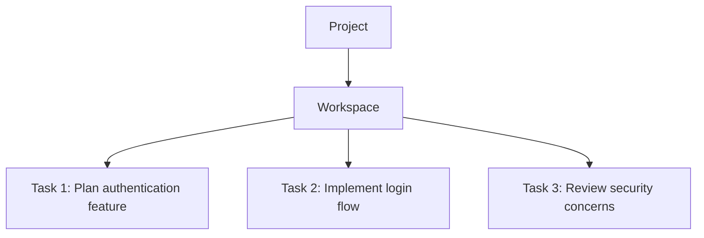

Multitasking in Verdent refers to handling multiple tasks within the same workspace, quickly creating and switching between conversation threads for related goals like planning, coding, and reviewing.

---

## What You'll Learn

- How in-workspace multitasking works
- Creating and switching between tasks
- How context is preserved across tasks
- Difference between multitasking and parallel execution
- Best use cases for multitasking

---

## What is In-Workspace Multitasking?

In-workspace Multitasking allows you to quickly create and switch between multiple tasks within the same workspace, making it easy to handle related goals without creating separate workspaces.

### How It Works

<CardGroup cols={2}>
  <Card title="Multiple Conversation Threads" icon="messages">
    Each task is a separate conversation with its own context
  </Card>
  <Card title="Shared File State" icon="folder">
    Tasks in the same workspace see the same files
  </Card>
  <Card title="Quick Switching" icon="shuffle">
    Jump between tasks instantly without overhead
  </Card>
  <Card title="Related Work" icon="link">
    Handle planning, coding, and reviewing together
  </Card>
</CardGroup>

---

## Creating and Managing Tasks

### Creating a New Task

| Platform | Shortcut |
|----------|----------|
| **macOS** | `Cmd+N` |
| **Windows** | `Ctrl+N` |

**Other Methods:**
- Click New Task button in the interface
- Submit a prompt in a workspace (creates a task automatically)

### What Happens

When you create a new task:
1. New conversation thread starts
2. Task appears in the Left Panel
3. Task shares the workspace's file state
4. Previous tasks remain accessible

### Switching Between Tasks

**Within Same Workspace:**
- Click task in the Left Panel
- Use New Task shortcut (Cmd+N / Ctrl+N) to create and switch

**Task Organization:**

---

## Context Preservation

### How Context Works

| Scope | What's Preserved |
|-------|------------------|
| **Within Workspace** | Tasks share file state; each task keeps its own conversation |
| **Across Workspaces** | Each workspace maintains separate context |
| **Across Projects** | Full context preserved when switching projects |

### Context When Switching Tasks

When you switch between tasks in the same workspace:

<Tabs>
  <Tab title="Preserved">
    - Full conversation history for each task
    - Where you left off in each conversation
    - File state (shared across tasks in workspace)
  </Tab>
  <Tab title="Shared">
    - File modifications (visible to all tasks in workspace)
    - Uncommitted changes
    - Current branch state
  </Tab>
</Tabs>

<Tip>
Tasks in the same workspace can see each other's file changes. Use separate workspaces when you need true isolation.
</Tip>

---

## Multitasking vs Parallel Execution

Understanding when to use multitasking vs parallel execution is key to effective workflow management.

### Comparison Table

| Aspect | In-Workspace Multitasking | Parallel Execution |
|--------|---------------------------|-------------------|
| **Location** | Multiple tasks in ONE workspace | Multiple agents across DIFFERENT workspaces |
| **Isolation** | Tasks share file state | Complete filesystem isolation |
| **Use Case** | Related tasks (plan, code, review) | Independent parallel work |
| **Conflicts** | Tasks can see each other's changes | No possible conflicts |
| **Context** | Shared files, separate conversations | Separate context per workspace |

### Key Distinction

**Tasks = Parallelize "non-coding work"**
- Solution discussion and comparison
- Requirement clarification and problem breakdown
- Technical research and risk assessment
- Code reading and understanding

**Workspaces = Parallelize "code-changing work"**
- Multiple implementations running in parallel
- Each workspace is fully isolated (own branch, commit history, file state)
- Changes don't interfere; conflicts are visible and manageable

### Decision Guide

<Tabs>
  <Tab title="Use Multitasking When">
    - Tasks are related and should share file state
    - You want to quickly switch between planning, coding, and reviewing
    - Work doesn't need isolation
    - You're exploring different aspects of the same feature
  </Tab>
  <Tab title="Use Parallel Execution When">
    - Tasks are independent and shouldn't affect each other
    - You need to try different approaches in isolation
    - You want multiple agents working simultaneously
    - You need to compare results before rebasing
  </Tab>
</Tabs>

---

## Best Practices

### Task Organization Tips

- **Name tasks descriptively**: "Plan auth" vs "Review auth" vs "Implement auth"
- **Keep related tasks together**: Same workspace for same feature
- **Use workspaces for independence**: Different features in different workspaces
- **Commit before switching workspaces**: Preserve work before moving

---

## FAQs

<Accordion title="How many tasks can I have in one workspace?">
There is no limit. You can create multiple tasks within a single workspace, each maintaining its own conversation context.
</Accordion>

<Accordion title="Do tasks in the same workspace share files?">
Yes. Tasks in the same workspace share the same file state. If Task A modifies a file, Task B will see that change. Use separate workspaces for isolation.
</Accordion>

<Accordion title="What happens to task history when I close Verdent?">
Task history persists. You can resume tasks where you left off when you reopen Verdent.
</Accordion>

<Accordion title="Can I move a task to a different workspace?">
No. Tasks are tied to their workspace and cannot be moved between workspaces.
</Accordion>

---

## See Also

<CardGroup cols={2}>
  <Card title="Agents" icon="users" href="/verdent/core-features/agents">
    Running multiple agents in isolated workspaces
  </Card>
  <Card title="Project Switching" icon="folder-open" href="/verdent/core-features/project-switching">
    Managing multiple projects
  </Card>
  <Card title="Managing Tasks" icon="list-check" href="/verdent/task-based-guides/managing-tasks">
    Complete task management guide
  </Card>
  <Card title="Workspace Isolation" icon="shield-halved" href="/verdent/core-features/workspace-isolation">
    When you need true isolation
  </Card>
</CardGroup>
