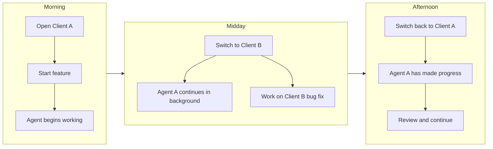

Project Switching enables you to jump between different projects instantly while Verdent keeps all workspace states alive. Move fluidly between multiple client projects or switch between your main repo and side projects without any setup delay or lost state.

---

## What You'll Learn

- How fast project switching works
- State preservation across project changes
- Managing multiple projects

---

## What is Project Switching?

Project Switching is Verdent's ability to maintain multiple open projects simultaneously and switch between them instantly with full state preservation.

### How It Works

| Feature | Description |
|---------|-------------|
| **Multiple Projects** | Keep many projects open at once |
| **Instant Switching** | Jump between projects with minimal loading |
| **State Preservation** | All workspace states remain alive |
| **Context Retention** | Conversation and task context preserved |

### Key Benefits

<CardGroup cols={2}>
  <Card title="Fast Loading" icon="bolt">
    Minimal waiting for projects to load
  </Card>
  <Card title="Full Context" icon="brain">
    Pick up exactly where you left off
  </Card>
  <Card title="Active Agents" icon="robot">
    Agents continue running when you switch projects
  </Card>
  <Card title="Fluid Workflow" icon="shuffle">
    Handle multiple clients throughout the day
  </Card>
</CardGroup>

---

## Fast Project Switching

### What Makes It Instant

Verdent keeps all project states in memory, enabling instant switching:

- **No Project Reload**: Project context stays loaded
- **Workspace States Alive**: All workspaces maintain their state
- **Tasks Preserved**: Active tasks continue where you left off
- **Agent Continuation**: Running agents keep working in the background

### Switching Methods

| Action | Method |
|--------|--------|
| **Current Project** | Click **Current Project** in the top bar |
| **Home** | Click **Home** in the top bar, then select your project |

---

## State Preservation

### What Gets Preserved

When you switch projects, Verdent maintains:

<Tabs>
  <Tab title="Per Project">
    - All workspace states (Base + Worktrees)
    - Session and conversation history
    - Running agent sessions
    - Project-specific settings (AGENTS.md, MCP servers)
  </Tab>
  <Tab title="Per Workspace">
    - Branch checkout state
    - Uncommitted changes
    - Active task reference
  </Tab>
  <Tab title="Per Task">
    - Full conversation history
    - Agent execution state
    - Where you left off
  </Tab>
</Tabs>

### Example Workflow

---

## Multi-Project Management

### Opening Projects

<Steps>
  <Step title="Open Project Dialog">
    Click **Home** in the top bar, then click **Open Project**
  </Step>
  <Step title="Select Directory">
    Navigate to your project's root directory
  </Step>
  <Step title="Open">
    Click Open to add the project to Verdent
  </Step>
</Steps>

### Managing Open Projects

| Action | How To |
|--------|--------|
| **Switch Project** | Click **Current Project** in the top bar |
| **Open New Project** | Click **Home** in the top bar, then **Open Project** |

---

## Project Limits

There is no limit to how many projects you can have open simultaneously.

- Multiple projects can be open simultaneously
- All states remain alive during the session

---

## Use Cases

### Common Scenarios

<Accordion title="Multiple Client Projects">
Handle work for multiple clients throughout the day:

1. Open Client A's project in the morning
2. Start agent on feature implementation
3. Switch to Client B for an urgent fix (agent A continues)
4. Switch back to Client A, check progress
5. Continue alternating as needed

All clients' states preserved.
</Accordion>

<Accordion title="Main Work + Side Project">
Balance your main job with personal projects:

1. Primary work project stays open all day
2. Open side project during breaks
3. Switch instantly between them
4. Side project preserves state even when not active
</Accordion>

<Accordion title="Multi-Repository Monorepo">
Work across related repositories:

1. Open frontend repository
2. Open backend repository
3. Open shared library repository
4. Switch between them as you implement features
</Accordion>

<Accordion title="Learning + Production">
Study codebases while working:

1. Keep production project open
2. Open open-source project to study patterns
3. Switch between to apply learnings
</Accordion>

---

## Best Practices

### Organization

| Practice | Why |
|----------|-----|
| **Name projects clearly** | Easy identification in project list |
| **Close unused projects** | Free up system resources |

### Workflow Tips

- **Let agents work**: Agents continue running in the background when you switch projects
- **Commit before long switches**: Save your state before extended time away
- **Use workspaces for major features**: Combine project switching with workspace isolation
- **Check agent status on return**: Review what agents accomplished while away

### Resource Management

| Consideration | Recommendation |
|---------------|----------------|
| **Many projects open** | Close projects you won't return to soon |
| **Memory usage** | Memory consumption depends on project size and active agents |
| **Agent activity** | Running agents consume resources |

---

## FAQs

<Accordion title="Do agents keep running when I switch projects?">
Yes, agents continue running in the background when you switch projects. You can return later to check their progress.
</Accordion>

<Accordion title="Is there a limit to how many projects I can have open?">
No, there is no limit. The system is designed for multi-project workflows with all states preserved.
</Accordion>

<Accordion title="What happens if I close a project with running agents?">
Running agents will be stopped when you close the project. Make sure to wait for agents to complete important work before closing.
</Accordion>

<Accordion title="Can I open the same project twice?">
No. Each project can only be open once. If you need multiple views of the same project, use workspaces within that project.
</Accordion>

<Accordion title="Can I open nested projects?">
No. Verdent does not support opening a project that is inside another open project. Each project must be a separate, non-nested directory.
</Accordion>

<Accordion title="Do project settings sync between sessions?">
Yes. Project-specific settings, conversation history, and task states are all preserved between Verdent sessions.
</Accordion>

---

## See Also

<CardGroup cols={2}>
  <Card title="Opening Projects" icon="folder-open" href="/verdent/task-based-guides/opening-projects">
    Step-by-step project opening guide
  </Card>
  <Card title="Parallel Execution" icon="users" href="/verdent/core-features/parallel-execution">
    Running agents in background
  </Card>
  <Card title="Workspace Isolation" icon="shield-halved" href="/verdent/core-features/workspace-isolation">
    Isolation within projects
  </Card>
</CardGroup>
