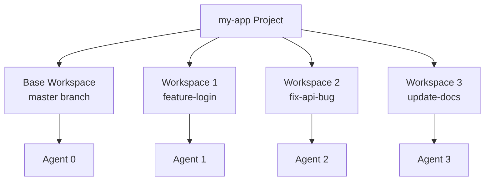

Verdent introduces a few core concepts that help you use AI more effectively. This page walks through the main building blocks of how work happens in Verdent: **Projects**, **Tasks**, **Execution Modes**, **Model Selection**, and **Workspaces**, and how they fit together.

A typical flow looks like this:

- You start by opening a **Project** — the local folder where your code and files live.
- Inside a project, you create a **Task** — running an agent to perform work within your codebase.
- When running a task, you choose an **Execution Mode** — **Agent Mode** to execute with write permissions, or **Plan Mode** to analyze and plan without modifying files.
- If needed, you can also choose a **Model** — different providers and models are better suited for different kinds of work.
- When multiple tasks need to change code in parallel, you use **Workspaces** — isolated working environments that keep changes separated and reduce conflicts.
---

## Projects

A **project** in Verdent is a local folder that you actively work in. It usually contains a codebase, but it **does not need to be a Git repository**.

**Project Features:**

- **Session Persistence**: Each project keeps its own session history and context
- **Project Rules**: Project-specific rules and guidelines (AGENTS.md)
- **Quick Switching**: Switch between projects instantly without losing context

**Project Management:**

| Action | Description |
|--------|-------------|
| **Open Project** | Select a folder to work on |
| **Recent Projects** | Quickly reopen projects you worked on recently |
| **Project Overview** | View active projects and their tasks at a glance |

---

## Tasks

A **task** in Verdent represents running an agent to perform work within your current codebase. Think of it as a **chat session with an agent**.

Tasks run in the current workspace, not in isolated environments. Creating multiple tasks means running multiple agents within the same codebase and workspace. While each task maintains its own conversation context, tasks are not isolated from each other—they all operate on the same files.

### Task Lifecycle

<Steps>
  <Step title="Create a Task">
    Start a new task by entering your prompt and sending it.
  </Step>
  <Step title="Run">
    Verdent executes the task. During execution, the task’s context grows as the conversation continues.
  </Step>
  <Step title="Complete">
    The task finishes and produces results (e.g., outputs, summaries, or code changes, depending on the task).
  </Step>
</Steps>

### Task Management

| Action | Description |
|--------|-------------|
| **New Task** | Start a new agent session for a new thread of work |
| **Switch Task** | Jump between tasks while keeping each task’s context intact |
| **Rollback** | Go back to an earlier checkpoint in the same task |
| **Duplicate** | Fork the task at a chosen point to explore another direction |
| **View Task Changes** | Review what changed in this task (e.g., via AI code review) |

### Rollback

Rollback lets you **return to a previous point in the same task** and continue from there.

What gets reverted:
- **Conversation context** added after the rollback point
- **Code changes** made after the rollback point

Why it’s useful:
- Recover quickly when the task goes in the wrong direction
- Try a different approach without manually undoing changes or rewriting context

### Duplicate

Duplicate lets you **fork a task from any point** and continue in parallel.

What it creates:
- A new task that starts with the **same context up to the selected point**
- Two tasks that evolve **independently** from that point forward

Why it’s useful:
- Explore multiple solutions side-by-side
- Compare approaches with the same starting assumptions and context

### Task States

| State | Description |
|-------|-------------|
| **Active** | Currently running or being worked on |
| **Paused** | Temporarily suspended, can be resumed |
| **Completed** | Execution finished and results are available |

---

## Execution Modes

When you run a task, you choose how Verdent should execute it. Verdent supports two primary execution modes that control how the AI handles permissions and interactions:

**Primary Modes:**

- **Agent Mode** (default) - Full autonomous execution with file modifications and command execution. Best for active development, implementing features, bug fixes, and running tests.
- **Plan Mode** - Read-only mode for analysis and planning without file modifications. Can ask clarifying questions before execution. Excellent for complex tasks, reviewing approaches, and architectural decisions.

<Tip>
To switch between modes, click the **Switch Mode** button in the input box, or press `Shift + Tab` or `Command + .`.
</Tip>

**Learn more:** [Execution Modes Overview](/verdent/execution-modes/overview)

---

## Model Selection

In addition to choosing an execution mode, you can choose which model (or provider) a task should use, depending on what you're trying to accomplish.

Verdent orchestrates models from multiple AI providers (Claude, GPT-5, Gemini) within a single workflow. Each specialized agent can leverage the optimal model for its specific task.

**Available Models:**

| Provider  | Model                  | Context | Max Mode | Best For | Cost |
| --------- | ---------------------- | ------- | -------- | -------- | ---- |
| Anthropic | claude-opus-4.5        | 200K    | 200K     | Great for deep coding tasks and problem-solving. | 1.6x |
| Anthropic | claude-sonnet-4.5      | 200K    | 1M       | Balanced complex tasks | 1x |
| Anthropic | claude-haiku-4.5       | 200K    | -        | Fast, simple tasks | 0.3x |
| Google    | gemini-3-pro-preview   | 200K    | 1M       | Advanced reasoning and multimodal | 0.45x |
| Google    | gemini-3-flash-preview | 200K    | 1M       | Pro-level reasoning with Flash-level latency and efficiency | 0.18x |
| OpenAI    | gpt-5                  | 272K    | -        | Reasoning and creativity | 0.75x |
| OpenAI    | gpt-5-codex (Beta)     | 272K    | -        | Coding and debugging | 0.75x |
| Zhipu AI  | GLM 4.7                | 200K    | -        | Agentic coding, complex reasoning, and tool-driven workflows | 0.43x |
| Moonshot  | kimi-k2-turbo          | 262K    | -        | Lightning-fast model for coding | 0.35x |

**Learn more:** [Configuration Settings](/verdent/configuration/settings)

---

## Workspaces

A **workspace** in Verdent is an isolated working environment within a project.
It's an advanced capability designed to solve a real problem: **when multiple tasks need to change code in parallel, changes can easily conflict.** Workspaces keep those changes separated, so you can move faster without making a mess.

<Tabs>
  <Tab title="Base Workspace">
    <Frame caption="Your main workspace with current project state">
      
    </Frame>
  </Tab>
  <Tab title="Create New Workspace">
    <Frame caption="Click the + button to create a new isolated workspace">
      
    </Frame>
  </Tab>
  <Tab title="Configure New Workspace">
    <Frame caption="Configure your new workspace">
      
    </Frame>
  </Tab>
</Tabs>

### Workspace Types

- **Base Workspace**  
  Your primary working environment on the branch you choose. It’s typically kept clean and stable, and serves as the reference point for integrating completed work.

- **Additional Workspaces**  
  Create multiple workspaces from the Base Workspace. Each workspace is isolated, with its own set of code changes, so you can work on different tasks (or different solutions) in parallel without interfering with each other.

### Why Workspaces Matter

| Benefit | Description |
|---------|-------------|
| **Isolation by Default** | Each workspace keeps its own changes separate from others |
| **Parallel Development** | Work on multiple tasks at the same time, safely |
| **Reduced Conflict Risk** | Switching between workstreams won’t mix changes or create accidental overlaps |
| **Safe Exploration** | Try different approaches in separate workspaces and keep only the best outcome |
| **Cleaner Integration** | Review and integrate workspace results back into the Base Workspace with clarity |

### Workspace Management

| Action | Description |
|--------|-------------|
| **Create Workspace** | Create a new isolated workspace from the Base Workspace |
| **Switch Workspace** | Move between workspaces instantly without losing progress |
| **Sync from main** | Bring the latest changes from the main branch into a workspace |
| **Merge / Rebase to main branch** | Integrate a workspace's result back into the main branch |
| **Delete Workspace** | Remove a workspace when it’s no longer needed |

---

## Parallel Execution

Verdent's defining feature is the ability to run multiple AI agents simultaneously, each in its own isolated workspace.

### How Parallel Execution Works

**Each workspace:**
- Has its own complete copy of the codebase
- Operates with isolated context
- Cannot interfere with other workspaces
- Produces reviewable, rebaseable changes

### When to Use Parallel Execution (Pyro)

| Scenario | Recommended Approach |
|----------|----------------------|
| **Independent features** | **Use Pyro** — run in parallel with separate Workspaces |
| **Bug fixes + feature work** | **Use Pyro** — isolate workstreams in separate Workspaces and run in parallel |
| **Sequential dependencies** | **Avoid Pyro** — use a single Workspace and execute tasks sequentially |
| **Quick fixes** | **Usually avoid Pyro** — do it in the Base Workspace with a single agent |

<Tip>
Use parallel execution for independent work. For tasks with dependencies, work sequentially to ensure correct ordering.
</Tip>

---

## Git Worktree Integration

Verdent Workspaces are built on top of **Git worktree**.  
You don't need to understand Git worktree to use Workspaces, but if you want to know the underlying mechanism, this section explains the basics.

### What is a Git Worktree?

A **Git worktree** is a Git feature that lets a single repository have **multiple working directories** at the same time.

In practice, this means:
- **Shared Git history**: all worktrees share the same commit history, branches, and tags
- **Separate working state**: each worktree has its own working directory state (files, uncommitted changes)
- **Branch-per-worktree**: a worktree is typically attached to its own branch
- **Native Git feature**: supported by standard Git tooling and works with all Git hosts

Verdent uses these properties to implement Workspace isolation, so parallel work can happen safely without mixing changes.

### Prerequisites

Workspaces require **Git 2.20+** to be installed on your system.  
See [Git Installation](/verdent/getting-started/git-installation) if you need to install or upgrade Git.

---

## FAQs

<Accordion title="What happens if two agents modify the same file?">
If two agents run in the **same workspace** and edit the same file, the result is **not deterministic**; later writes may overwrite earlier ones. Verdent does not guarantee safe conflict handling inside a single workspace.

If you expect two agents might touch the same file, run them in **separate workspaces** instead. Each workspace is isolated, so both sets of changes are preserved independently. You can then review the results and decide what to keep (for example, merge one workspace and discard the other, or manually combine them).
</Accordion>

<Accordion title="How many parallel agents can I run?">
Verdent doesn't impose a hard limit. Practical limits depend on:
- **System resources**: Each agent consumes memory and CPU
- **API rate limits**: Credit consumption scales with active agents
- **Git worktree limits**: Git handles many worktrees efficiently

Most users run 2-4 parallel agents effectively.
</Accordion>

<Accordion title="Do workspaces share node_modules and other dependencies?">
No, each workspace is a complete copy of the working directory. You may need to install dependencies (`npm install`, `pip install`, etc.) in each new workspace. Some users configure shared caches to speed up dependency installation.
</Accordion>

<Accordion title="What's the difference between a task and a workspace?">
- **Task**: Running an agent to perform work. Multiple tasks run in the same workspace and operate on the same files.
- **Workspace**: An isolated working environment (Base Workspace or New Workspace) where code changes happen.

For parallel code changes that shouldn't interfere, use separate workspaces.
</Accordion>

<Accordion title="Do tasks share context with each other?">
Tasks share the same codebase and files, but each task maintains its own conversation context. Changes made by one task are visible to other tasks in the same workspace.
</Accordion>

<Accordion title="Does Verdent work with non-git repositories?">
Yes. If your project doesn't have Git initialized, Verdent creates its own Git repository for tracking changes and enabling workspace isolation. The worktree feature requires Git, but Verdent handles the setup automatically.
</Accordion>

<Accordion title="What happens if I delete a workspace with uncommitted changes?">
Uncommitted changes are lost. Before deleting a workspace, review changes and rebase any work you want to keep.
</Accordion>

<Accordion title="How do I discard changes from a task I don't want?">
Use the Discard Changes feature in the Source Control tab, or delete files directly in the Explorer tab.
</Accordion>

---

## See Also

<CardGroup cols={2}>
  <Card title="Plan Mode" icon="clipboard-list" href="/verdent/core-features/plan-mode">
    Capture requirements and plan before executing
  </Card>
  <Card title="Agents" icon="layer-group" href="/verdent/core-features/agents">
    Deep dive into agents
  </Card>
</CardGroup>
