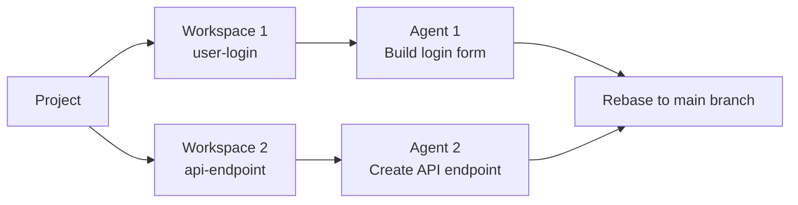

This quickstart guide will have you using Verdent's Plan-Verify-Code workflow in under 15 minutes. You'll open a project, complete your first task, and understand the basic workflow.

### What You'll Learn

- Open a project in Verdent
- Complete your first AI-assisted task
- Understand execution modes
- Create and manage workspaces for parallel work

### Prerequisites

Before you begin, make sure you have:

- Verdent installed ([Installation Guide](/verdent/getting-started/installation))
- A project directory to work with
- Signed in to your Verdent account

---

## Step 1: Open Your First Project

<Steps>
  <Step title="Launch Verdent">
    Open Verdent from Applications (macOS) or Start Menu (Windows)
  </Step>
  <Step title="Open Project">
    Click **Open Project** and select a directory
  </Step>
  <Step title="Project Loads">
    Verdent opens the project and displays the main interface
  </Step>
</Steps>

<Note>
If your project isn't a Git repository, Verdent handles this automatically by creating its own Git repository for tracking changes and enabling workspace isolation.
</Note>

---

## Step 2: Your First Task

Let's start with a simple, non-destructive task that demonstrates Verdent's understanding of your project.

**Type this in the chat input:**

```
What kind of project is this?
```

**What happens:**
1. Verdent analyzes your project structure
2. Reads key files (package.json, README, config files)
3. Explains your project type, technologies, and structure
4. No files are modified (read-only analysis)

**Try these follow-up prompts:**

```
Explain what this project does
```

```
Show me the main entry point
```

```
What dependencies does this project use?
```

<Tip>
These exploratory prompts help Verdent build context about your project and help you verify that Verdent understands your codebase.
</Tip>

---

## Step 3: Make Your First Code Change

Now let's have Verdent create something:

```
Create a hello_world.txt file with a greeting message
```

**What happens:**

<Steps>
  <Step title="Verdent Analyzes Request">
    Verdent understands your request and plans the approach
  </Step>
  <Step title="Execution">
    Verdent creates the file autonomously (Agent Mode is fully autonomous)
  </Step>
  <Step title="Review Results">
    Review what was created, Code Review provides feedback
  </Step>
</Steps>

**Understanding Agent Mode:**

In Agent Mode (default), Verdent executes operations autonomously without per-action approval. After completion:
- **Task Changes** shows exactly what changed
- **Code Review** provides structured feedback
- **Source Control** lets you commit, revert, or modify changes

<Tip>
Use Plan Mode if you want to review the approach before execution. Agent Mode executes immediately and lets you review afterward.
</Tip>

---

## Step 4: Using Plan Mode

Plan Mode is Verdent's read-only planning mode for complex tasks.

**Switch to Plan Mode:**

Press `Shift + Tab`, `Ctrl + .` (Windows), or `Cmd ⌘ + .` (macOS), or click the **Switch Mode** button in the input box

**Try a planning task:**

```
Identify issues in the current project and fix them
```

**What happens:**

1. Verdent analyzes your project thoroughly
2. Creates a detailed plan with recommendations
3. **No modifications occur** - Plan Mode is read-only
4. You can ask clarifying questions about the plan

**After reviewing the plan:**

- Choose **Edit** to refine the plan
- Choose **Start Building** to execute (switches to Agent Mode)

<Tip>
Use Plan Mode for complex features where you want to review the approach before committing to execution.
</Tip>

---

## Step 5: Understanding Workspaces

Workspaces provide isolation for parallel development. Each workspace is a separate git worktree.

**Workspace Concepts:**

- **Workspace** - A git worktree, an isolated working directory
- **Tasks** - Agents working within a workspace
- Multiple tasks can run in the same workspace

**Workspace Benefits:**

| Benefit | Description |
|---------|-------------|
| **Isolation** | Changes don't affect your main branch |
| **Parallel work** | Multiple workspaces can run simultaneously |
| **Safe experimentation** | Discard workspace if changes aren't wanted |
| **Clean rebases** | Each workspace produces a clean, reviewable branch |

**Workspace Management:**

| Action | Description |
|--------|-------------|
| **Create Workspace** | Create a new isolated worktree |
| **Switch Workspace** | Navigate between workspaces |
| **Rebase to main branch** | Apply workspace changes to the main branch |
| **Sync with main branch** | Pull latest changes from main branch into the workspace |

---

## Step 6: Parallel Execution

Verdent's unique feature is running multiple agents in parallel.

**Start parallel workspaces:**

<Steps>
  <Step title="Create Workspace">
    Click **New Workspace** in the top bar. In the Create New Workspace modal:
    - Name the workspace (e.g., `feature/user-login`)
    - Select branch to branch from (From Branch: Master)
    - Optionally add a setup script to run when the workspace is created (e.g., `pnpm install` to install dependencies)
  </Step>
  <Step title="Start Task in Workspace">
    Give the workspace a prompt:
    ```
    Build a user login form with email and password fields
    ```
  </Step>
  <Step title="Create Another Workspace">
    Click **New Workspace** again and create a second workspace (e.g., `feature/api-endpoint`). Start a different task:
    ```
    Create an API endpoint for user data
    ```
    Both agents work simultaneously without conflicts.
  </Step>
  <Step title="Rebase When Ready">
    When work is complete, use **Workspace Actions** → **Rebase to main branch** to apply changes

    <Warning>
    Commit all changes before rebasing. Verdent does not automatically commit code, so use Source Control to stage and commit your changes first.
    </Warning>
  </Step>
</Steps>

**Example workflow:**



<Tip>
For your first projects, start with single-workspace workflows. Use parallel execution once you're comfortable with the basics.
</Tip>

---

## Execution Modes Reference

| Mode | Description | Best For |
|------|-------------|----------|
| **Agent Mode** | Full autonomous execution | Active development, implementation |
| **Plan Mode** | Read-only planning | Complex features |

**Switch modes:** Press `Shift+Tab` / `Ctrl+.` or click **Switch Mode** in the input box.

---

## Essential Actions

| Action | How to Access | Description |
|--------|---------------|-------------|
| Open Project | **Current Project** → **New Project** | Select a directory |
| New Task | **New Task** | Start fresh conversation |
| Switch Mode | `Shift+Tab` / `Ctrl+.` or **Switch Mode** button | Toggle execution modes |
| Create Workspace | **New Workspace** | Create isolated worktree |
| Switch Workspace | Select from workspaces in top bar | Navigate between workspaces |
| Open Settings | **Verdent** → **Settings** | Configure Verdent |
| View Changes | **Source Control** → Select file | Review AI-generated changes |

---

## Pro Tips for Beginners

<Accordion title="Start with exploration">
Before making changes, let Verdent understand your project:
- "What does this function do?"
- "Explain the architecture"
- "Find all API endpoints"

This builds context and helps you verify Verdent understands your code.
</Accordion>

<Accordion title="Be specific with requests">
Instead of: "fix the bug"

Try: "fix the login bug where users see a blank screen after incorrect password"

Specific prompts lead to more accurate solutions.
</Accordion>

<Accordion title="Use Plan Mode or a workspace for unfamiliar code">
When working with code you don't fully understand:
1. Switch to Plan Mode to analyze and plan without making changes
2. Or create a new workspace to experiment safely
3. Review the plan or changes
4. Execute with **Start Building** or rebase when confident
</Accordion>

<Accordion title="Break complex tasks into steps">
For multi-step features:
1. Complete one component at a time
2. Verify each step before continuing
3. Use separate workspaces for independent features

This maintains clarity and allows verification at each stage.
</Accordion>

---

## Getting Help

- **Discord Community**: [https://discord.com/invite/NGjXEZcbJq](https://discord.com/invite/NGjXEZcbJq) - Active community with real-time support
- **Documentation**: Browse other guides in this documentation
- **Feedback**: Use the Feedback button in Verdent's top bar to report issues or suggest improvements

---

## FAQs

<Accordion title="What happens to my workspaces when I close Verdent?">
Workspaces persist on disk as git worktrees. When you reopen the project, Verdent detects existing workspaces and restores their state in the interface.
</Accordion>

<Accordion title="Can I work in the same project in VS Code and Desktop?">
Yes, but use different workspaces. Never have both tools modifying the same files simultaneously. Use Verdent for parallel agent work and VS Code for your personal coding.
</Accordion>

<Accordion title="How do I rebase workspace changes?">
1. Complete work in the workspace
2. Review changes
3. Use **Workspace Actions** → **Rebase to main branch** to apply changes
4. Optionally delete the workspace after rebasing
</Accordion>

---

## Next Steps

<CardGroup cols={2}>
  <Card title="Core Concepts" icon="lightbulb" href="/verdent/getting-started/core-concepts">
    Understand projects, workspaces, and parallel execution
  </Card>
  <Card title="Interface Guide" icon="window" href="/verdent/getting-started/interface">
    Explore the Verdent interface
  </Card>
</CardGroup>
