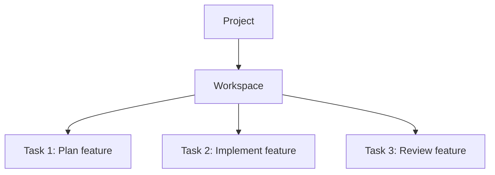

Tasks in Verdent are conversation threads within a workspace. This guide covers creating, switching, and organizing tasks for efficient multi-task workflows.

---

## What You'll Learn

- How to create new tasks
- Switching between tasks
- Organizing and naming tasks
- Task context and state management
- Best practices for task workflows

---

## Understanding Tasks

### What Is a Task?

A task is a conversation thread within a workspace. Each task:

| Property | Description |
|----------|-------------|
| **Conversation** | Has its own message history |
| **Context** | Maintains its own AI context |
| **Agent** | Has its own agent with custom configuration (model, rules) |
| **Workspace** | Belongs to a specific workspace |
| **File Access** | Shares file state with other tasks in the same workspace |

### Task Hierarchy

---

## Creating New Tasks

### Using the New Task Button

<Steps>
  <Step title="Open Workspace">
    Ensure you're in the workspace where you want the task
  </Step>
  <Step title="Click New Task">
    Click **New Task** or press `Cmd+N` / `Ctrl+N`
  </Step>
  <Step title="Start Conversation">
    Type your first message to begin the task
  </Step>
</Steps>

### Automatic Task Creation

A new task is automatically created when you:
- Submit a prompt in an empty workspace
- Click New Task in the interface

### What Happens When You Create a Task

| Step | Description |
|------|-------------|
| **Task Created** | New conversation thread initialized |
| **Context Set** | Fresh AI context starts |
| **Listed** | Task appears in task list |
| **Ready** | You can begin interacting |

---

## Switching Between Tasks

### Using the Task List

The task list in the Left Panel shows all tasks in the current workspace:

| Element | Description |
|---------|-------------|
| **Task list** | All tasks in current workspace |
| **Current task** | Highlighted or marked |
| **Task preview** | First message or task name |

### Switching Methods

| Method | How To |
|--------|--------|
| **Click in task list** | Click the task you want |
| **New Task shortcut** | Cmd+N / Ctrl+N creates and switches |

### State Preservation When Switching

When you switch tasks:

<Tabs>
  <Tab title="What's Preserved">
    - Full conversation history
    - AI context for the task
    - Model and agent configuration
    - Where you left off
  </Tab>
  <Tab title="What's Shared">
    - File state (same workspace)
    - Uncommitted changes
    - Branch state
  </Tab>
</Tabs>

<Tip>
Tasks in the same workspace share file state. If you need file isolation, use separate workspaces.
</Tip>

---

## Organizing Tasks

### Task Organization Tips

| Practice | Benefit |
|----------|---------|
| **One topic per task** | Clear, focused conversations |
| **Related tasks same workspace** | Shared file access |
| **Unrelated tasks new workspace** | Clean separation |

---

## Task Workflows

### Plan → Implement → Review

Use multiple tasks for a complete workflow:

<Steps>
  <Step title="Create Planning Task">
    Task 1: Plan the feature in Plan Mode
  </Step>
  <Step title="Create Implementation Task">
    Task 2: Implement based on the plan
  </Step>
  <Step title="Create Review Task">
    Task 3: Review the implementation
  </Step>
</Steps>

All tasks share the same workspace, so they see the same files.

### Quick Question During Work

When you need to ask a quick question without disrupting your main task:

1. Create a new task (Cmd+N / Ctrl+N)
2. Ask your question
3. Get the answer
4. Switch back to main task

Your main task's context is preserved.

### Iterative Development

| Task | Purpose |
|------|---------|
| Task 1 | Initial implementation |
| Task 2 | Refinements and fixes |
| Task 3 | Final polish |

Each task builds on previous work since they share file state.

---

## Task Context Management

### How Task Context Works

Each task maintains:

| Context Type | Description |
|--------------|-------------|
| **Conversation** | All messages in the task |
| **AI Memory** | What the AI knows about this task |
| **Configuration** | Model selection and agent settings |
| **Progress** | Where in the task you are |

### Context Between Tasks

| Scope | Behavior |
|-------|----------|
| **Same workspace** | Tasks share file state, not conversation |
| **Different workspaces** | Full isolation |

---

## Best Practices

### When to Create New Tasks

<Accordion title="Good Reasons for New Task">
- Starting a different topic
- Asking a quick question
- Different phase of work (plan → implement)
- Clean slate for new approach
</Accordion>

<Accordion title="When to Continue Same Task">
- Iterating on same feature
- Follow-up questions
- Continuing previous conversation
- Building on established context
</Accordion>

### Task Hygiene

| Practice | Why |
|----------|-----|
| **Keep tasks focused** | Better AI context |
| **Don't overload topics** | Too many topics confuse the AI |
| **Close completed tasks** | Keep workspace clean |
| **Review old tasks** | Remove tasks no longer needed |

- Start tasks with clear first messages
- Group related work in same workspace
- Use workspaces for major separations

---

## Troubleshooting

### Common Issues

<Accordion title="Can't find my task">
**Solutions:**
- Check task list in the Left Panel
- You may be in a different workspace
- Switch workspaces to find the task
</Accordion>

<Accordion title="Task lost context">
**Possible causes:**
- Very long conversation
- Exceeded context limits

**Solutions:**
- Summarize key points for the AI
- Start fresh task with summary
- Reference specific files
</Accordion>

<Accordion title="Tasks piling up">
**Solutions:**
- Close completed tasks
- Consolidate related tasks
- Use workspace organization
</Accordion>

---

## FAQs

<Accordion title="Do tasks share memory?">
No. Each task has its own conversation context. They share file state if in the same workspace, but not conversation memory.
</Accordion>

<Accordion title="What happens to tasks when I close Verdent?">
Task history persists between sessions. You can resume tasks where you left off when you reopen Verdent.
</Accordion>

<Accordion title="Can I reference work from other tasks?">
Tasks don't automatically know about other tasks. Reference files that were modified, summarize previous decisions, or use @-mentions to include specific files.
</Accordion>

<Accordion title="Can I use different models for different tasks?">
Yes. Each task has its own agent configuration including model selection.
</Accordion>

<Accordion title="How do I delete a task?">
Hover over the task in the task list and click the Delete button.
</Accordion>

<Accordion title="Do tasks in parallel workspaces share anything?">
No. Tasks in different workspaces are fully isolated with no shared files or context.
</Accordion>

---

## See Also

<CardGroup cols={2}>
  <Card title="Multitasking" icon="list-check" href="/verdent/core-features/multitasking">
    In-depth multitasking guide
  </Card>
  <Card title="Workspace Isolation" icon="shield-halved" href="/verdent/core-features/workspace-isolation">
    When to use separate workspaces
  </Card>
  <Card title="Opening Projects" icon="folder-open" href="/verdent/task-based-guides/opening-projects">
    Project management
  </Card>
  <Card title="Context Awareness" icon="brain" href="/verdent/core-features/context-awareness">
    How context works
  </Card>
</CardGroup>
