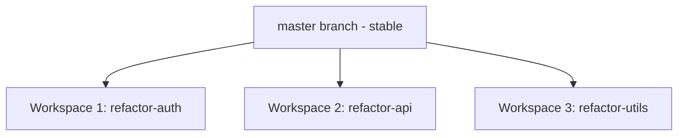

Verdent's workspace isolation makes refactoring safer by allowing you to experiment in isolated workspaces before rebasing changes.

## What You'll Learn

- Use workspace isolation for safe refactoring
- Execute multi-file refactoring workflows
- Leverage parallel agents for large refactors

---

## Using Workspace Isolation

### Why Workspaces for Refactoring

| Benefit | Description |
|---------|-------------|
| **Safe experimentation** | Changes isolated from master branch |
| **Easy rollback** | Delete workspace to discard changes |
| **Clean diffs** | All changes in one reviewable branch |
| **No interference** | Other work continues unaffected |

### Refactoring Setup

<Steps>
  <Step title="Create Workspace">
    Click **New Workspace** in the Top Bar with a descriptive name (e.g., `refactor-auth-module`)
  </Step>
  <Step title="Work in Workspace">
    Verdent now operates in the isolated workspace
  </Step>
  <Step title="Execute Refactoring">
    In the input box, describe the refactoring changes you want
  </Step>
  <Step title="Review Changes">
    Click **Task Changes** in the middle panel to review all modifications
  </Step>
  <Step title="Rebase or Discard">
    Click **Workspace Actions → Rebase to master** if satisfied, or **Delete Workspace** in the Workspace Bar to discard
  </Step>
</Steps>

---

## Refactoring Workflows

<Tabs>
  <Tab title="Rename">
    Rename symbols across your entire codebase:

    ```
    Rename the function getUserData to fetchUserProfile across the entire codebase,
    including all imports, references, and documentation
    ```

    **What Verdent does:**
    1. Finds all occurrences using search
    2. Updates function definition
    3. Updates all import statements
    4. Updates all call sites
    5. Updates comments and documentation
  </Tab>
  <Tab title="Extract">
    Extract logic into separate functions or components:

    ```
    Extract the validation logic from @userForm.tsx into a separate validateUserInput function
    in @utils/validation.ts
    ```

    **What Verdent does:**
    1. Identifies the logic to extract
    2. Creates the new function/file
    3. Updates original to use the extracted code
    4. Maintains all imports and types
  </Tab>
  <Tab title="Restructure">
    Restructure code architecture:

    ```
    Refactor @services/ from class-based services to functional modules.
    Follow the pattern in @services/productService.ts which has already been converted.
    ```

    **Best approach:**
    1. Use **Plan Mode** first to review approach
    2. Approve plan after reviewing scope
    3. Execute in isolated workspace
    4. Review all changes before rebasing
  </Tab>
</Tabs>

---

## Comparing Changes

### Review Workflow

<Steps>
  <Step title="Open Task Changes">
    Click **Task Changes** in the middle panel to review changes
  </Step>
  <Step title="Review Each File">
    Navigate through changed files
  </Step>
  <Step title="Verify Tests">
    Run tests to verify refactoring correctness
  </Step>
</Steps>

---

## Desktop-Specific Refactoring

### Parallel Refactoring

For large codebases, split refactoring across workspaces:



**Coordination:**
- Assign independent modules to different workspaces
- Minimize overlap to reduce rebase conflicts
- Rebase in dependency order

<Tip>
Use Plan Mode first to define the target architecture and function signatures. Pass these signatures to each agent so they understand the final structure and can implement compatible interfaces across workspaces.
</Tip>

### Plan Mode for Complex Refactors

<Steps>
  <Step title="Switch to Plan Mode">
    Press `Shift+Tab` or `Ctrl+.` to switch to Plan Mode
  </Step>
  <Step title="Describe Refactoring">
    In the input box, describe the refactoring:
    ```
    Plan a refactoring of the authentication module to:
    - Split monolithic auth service into smaller focused services
    - Add proper TypeScript types
    - Improve testability
    ```
  </Step>
  <Step title="Review Plan">
    Verdent creates detailed plan with affected files and steps
  </Step>
  <Step title="Iterate">
    Ask questions, refine approach until satisfied
  </Step>
  <Step title="Execute">
    Switch to **Agent Mode** to implement in the workspace
  </Step>
</Steps>

---

## Common Refactoring Patterns

<Tabs>
  <Tab title="Extract Common Logic">
    ```
    The @UserList.tsx and @ProductList.tsx components share pagination logic.
    Extract the common pagination logic into a usePagination hook in @hooks/
    ```
  </Tab>
  <Tab title="Update Deprecated">
    ```
    Update all class components in @components/ to functional components with hooks.
    Preserve the existing behavior and props interface.
    ```
  </Tab>
  <Tab title="Improve Types">
    ```
    Add proper TypeScript types to @api/client.ts.
    The API responses currently use 'any' types - create proper interfaces based on the actual response shapes.
    ```
  </Tab>
  <Tab title="Consolidate Duplicates">
    ```
    Find and consolidate duplicate utility functions across @utils/ and @helpers/.
    Keep the most complete implementation and update all imports.
    ```
  </Tab>
</Tabs>

---

## FAQs

<Accordion title="What if refactoring breaks something?">
In a workspace:
1. Run tests to identify failures
2. Fix issues or request Verdent to fix
3. If too broken, delete workspace and start fresh

The master branch remains unaffected until you rebase.
</Accordion>

<Accordion title="How do I handle conflicts when rebasing?">
1. Complete refactoring in workspace
2. Sync with master using **Workspace Actions → Sync with master**
3. Resolve any conflicts in the workspace
4. Then click **Workspace Actions → Rebase to master**

This keeps conflict resolution contained to the workspace.
</Accordion>

<Accordion title="Should I refactor in small pieces or all at once?">
**Small pieces** are safer:
- Easier to review
- Faster to rollback if needed
- Tests can validate each step

**All at once** can work for:
- Tightly coupled changes
- Rename operations
- When using isolated workspace
</Accordion>

---

## See Also

<CardGroup cols={2}>
  <Card title="Workspace Isolation" icon="code-branch" href="/verdent/core-features/workspace-isolation">
    How workspaces enable safe refactoring
  </Card>
</CardGroup>
